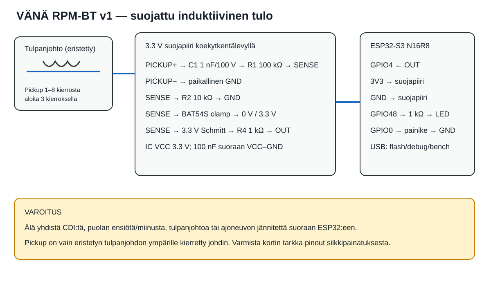

# Wiring and installation

The authoritative physical layouts are [PLACEMENT_GUIDE.md](PLACEMENT_GUIDE.md), `diagrams/breadboard_74hc14.svg` and `diagrams/perfboard_74hc14.svg`.

## Pin-to-pin netlist

1. Wind one insulated wire **3 turns** around the insulated spark-plug lead. This is L1. Do not cut, pierce or expose the HT lead.
2. PICKUP-HOT → C1 1 nF (>=100 V) → R1 100 kΩ → SENSE.
3. PICKUP-RETURN → local sensor GND only. There is no connection to engine, coil, HT conductor or vehicle ground.
4. SENSE → R2 10 kΩ → GND; BAT54S clamps SENSE to 0 V and 3.3 V as shown in the placement guide.
5. SENSE → one 74HC14 input. Power only from ESP32 3V3 and place 100 nF directly at IC VCC/GND. Tie every unused input to a defined rail; never leave it floating.
6. 74HC14 output → R4 1 kΩ → ESP32-S3 GPIO4. Firmware uses rising-edge interrupts.
7. Optional LED: GPIO48 → 1 kΩ → LED → GND. GPIO0 button is optional and is not needed for measurement.
8. Power the dev board from USB/power bank in V1, not raw vehicle 12 V.

GPIO4 and 74HC14 must remain within 0–3.3 V. Do not substitute a 5 V-only logic part or a module whose output pulls up to 5 V.

## Why no optocoupler

There is already galvanic separation from the ignition conductor: field coupling across intact insulation, no vehicle-ground connection and power-bank power. A common optocoupler needs more current, varies strongly by CTR and makes weak-pulse triggering less predictable. It can be revisited only if measured common-mode problems remain.

## Mechanical installation

- Begin with 3 tight, adjacent turns around the middle section of the plug lead. Wind direction only changes polarity; the NPN path accepts one polarity. Reverse PICKUP-HOT/RETURN if no pulses occur.
- Keep at least 100 mm from the ignition coil and start 80–150 mm from the plug cap. Move farther from either end if it double-triggers; add turns before moving closer.
- Tape the turns with self-amalgamating silicone tape; do not use a metal clamp. Add a service loop and strain relief so the pickup cannot pull the HT lead.
- Twist HOT and RETURN together from the wrap to the enclosure. For a run over ~300 mm, use a shielded pair with shield connected only to sensor GND at the enclosure.
- Route at least 50 mm from exhaust and moving parts and separately from coil primary/charging wiring. Cross noisy cables at 90°, not parallel.
- Put the protected input at the cable entry and the ESP32 antenna at the opposite plastic end. No metal directly over the antenna.
- Use a closed, flame-retardant enclosure on a rubber-isolated fixed point. Inspect after warming and after every remount.

